# Operating System
### **What is an Operating System (OS)?**  

An **Operating System (OS)** is a special software that helps a computer work properly. It acts as a **bridge** between the computer's **hardware** (CPU, RAM, hard disk, etc.) and the **user** (you).  

### **Example to Understand Easily**  
Think of a restaurant.  
- The **kitchen** (hardware) cooks food.  
- The **customer** (user) wants to eat food.  
- But the customer doesn’t talk directly to the kitchen. Instead, a **waiter** (OS) takes the order and brings the food.  

Just like the waiter helps the kitchen and customer communicate, an **OS helps the user and hardware work together smoothly.**  

### **Main Functions of an OS**  
1. **Manages Hardware** – Controls CPU, memory, and storage.  
2. **Runs Programs** – Helps apps and software work properly.  
3. **File Management** – It allocates and de-allocates the resources and also decides who gets the resource. 
4. **Device Control** – Handles keyboard, mouse, printer, etc.  
5. **User Interface** – Gives a way to interact (like Windows screen or Linux terminal).  
6. **Memory Management** – Allocates and manages the computer's memory.  
7. **Process Management** – It allocates the processor to a process and then de-allocates the processor when it is no longer required or the job is done. 
8. **Input-Output Management** – Manages input and output operations.  
9. **Error Handling** – Detects and handles errors.  
10. **Parallel Processing** – Manages the execution of multiple processes simultaneously.  
11. **Security Management** – Protects the system from unauthorized access.  
12. **Role - Government** – Ensures the system operates efficiently and enforces policies.  

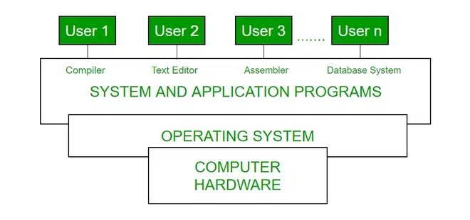

### **Examples of OS**  
- **Windows**  
    - **Developer**: Microsoft  
    - **Key Features**: User-friendly interface, software compatibility, hardware support, strong gaming support.  
    - **Advantages**: Easy to use, broad support from third-party applications, frequent updates and support.  
    - **Typical Use Cases**: Personal computing, business environment, gaming.  

- **macOS**  
    - **Developer**: Apple  
    - **Key Features**: Sleek, intuitive user interface, strong integration with other Apple products, robust security features, high performance and stability.  
    - **Advantages**: Optimized for Apple hardware, seamless experience across Apple ecosystem, superior graphics and multimedia capabilities.  
    - **Typical Use Cases**: Creative industries (design, video editing, music production), personal computing, professional environments.  

- **Linux**  
    - **Developer**: Community-driven (various distributions)  
    - **Key Features**: Open-source and highly customizable, robust security and stability, lightweight and can run on older hardware, large selection of distributions (e.g., Ubuntu, Fedora, Debian).  
    - **Advantages**: Free to use and distribute, strong community support, suitable for servers and development environments.  
    - **Typical Use Cases**: Servers and data centers, development and programming, personal computing for tech enthusiasts.  

- **Unix**  
    - **Developer**: Originally AT&T Bell Labs, various commercial and open-source versions available  
    - **Key Features**: Multiuser and multitasking capabilities, strong security and stability, powerful command-line interface, portability across different hardware platforms  
    - **Advantages**: Reliable and robust performance, suitable for high-performance computing and servers, extensive support for networking  
    - **Typical Use Cases**: Servers and workstations, development environments, research and academic settings  

- **Android**  
    - **Developer**: Google  
    - **Key Features**: Open-source, customizable, large app ecosystem, strong integration with Google services.  
    - **Advantages**: Wide device compatibility, frequent updates, strong developer support.  
    - **Typical Use Cases**: Mobile phones, tablets, smart TVs.  

- **iOS**  
    - **Developer**: Apple  
    - **Key Features**: Sleek and intuitive interface, strong security features, seamless integration with Apple ecosystem, high performance.  
    - **Advantages**: Optimized for Apple hardware, extensive app ecosystem, regular updates and support.  
    - **Typical Use Cases**: iPhones, iPads, iPods.  

### **In Short:**  
An **Operating System** is the **brain of a computer** that helps everything work together so that we can use the computer easily! 🚀  

### **Components of an Operating System**  

An **Operating System (OS)** has two main components:  

1. **Shell**  
   - The **outermost layer** of the OS.  
   - Handles interaction between the **user** and the **OS**.  
   - Takes **commands** from the user, processes them, and gives **output**.  
   - Example: **Command-Line Interface (CLI)** or **Graphical User Interface (GUI)**.

2. **Kernel**  
   - The **core part** of the OS.  
   - Directly interacts with **hardware** like CPU, memory, and devices.  
   - Manages **system calls, memory, and applications**.  

#### **Functions of Kernel:**  
- **System Call Control** – Manages communication between software and hardware.  
- **I/O Management** – Controls input/output operations.  
- **Process & Memory Management** – Handles running programs and memory allocation.  

#### **Types of Kernel:**  
- **Monolithic Kernel** – Large and includes all system services in one place.  
- **Microkernel** – Minimal, with only essential functions, and other services run separately.  
- **Hybrid Kernel** – Mix of monolithic and microkernel, used in modern OS like Windows.  
- **Exokernel** – Very lightweight and customizable, used in research-based systems.  

### **Difference Between 32-Bit and 64-Bit Operating Systems**  

| Feature               | **32-Bit OS**                          | **64-Bit OS**                          |
|----------------------|--------------------------------|--------------------------------|
| **Processor Compatibility** | Works only on **32-bit processors**. | Works on both **32-bit and 64-bit processors**. |
| **Performance**       | **Less efficient**, slower processing. | **More efficient**, faster processing. |
| **RAM Support**       | Can use **up to 4GB RAM** only. | Can use **more than 4GB RAM**, up to **16 exabytes** theoretically. |
| **Data Handling**     | Can handle **smaller amounts of data**. | Can handle **larger amounts of data**. |
| **Register Size**     | Uses **32-bit registers** in the CPU. | Uses **64-bit registers**, making calculations faster. |
| **Software Compatibility** | Can run only **32-bit software**. | Can run both **32-bit and 64-bit software** (but not always the other way around). |
| **Security**         | **Less secure** due to weaker encryption. | **More secure**, supports better encryption and system protection. |

### **Which One Should You Choose?**
- **For old computers** with **less than 4GB RAM** → Use **32-bit OS**.  
- **For modern computers** with **more than 4GB RAM** → Use **64-bit OS** for better performance. 🚀

### **Advantages and Disadvantages of Operating System**  

#### ✅ **Advantages of Operating System**  
1. **Easy to Use** – Provides a user-friendly interface (Graphical User Interface - GUI) for interacting with the computer.  
2. **Resource Management** – Efficiently manages CPU, memory, and storage, ensuring smooth operation.  
3. **Multitasking** – Allows running multiple applications at the same time.  
4. **Security & Protection** – Protects user data with security features like firewalls, encryption, and user authentication.  
5. **Hardware Management** – Controls hardware devices like printers, keyboards, and storage efficiently.  
6. **Error Handling** – Detects and handles system errors, ensuring system stability.  
7. **Networking Support** – Helps in communication between computers over networks like the internet.  

#### ❌ **Disadvantages of Operating System**  
1. **High Cost** – Some OS, like Windows and macOS, are expensive.  
2. **Complexity** – Some OS require technical knowledge to use effectively.  
3. **Security Risks** – Prone to viruses, malware, and hacking if not properly managed.  
4. **Hardware Dependency** – Some OS work only with specific hardware.  
5. **Software Compatibility Issues** – Not all software runs on every OS (e.g., Windows software won’t run on macOS without special tools).  
6. **Frequent Updates** – Some OS require regular updates, which can be time-consuming.  
7. **Performance Issues** – If an OS is not optimized, it can slow down the computer.  

### **Conclusion:**  
Operating Systems are essential for managing computer resources, but choosing the right OS depends on user needs, security, performance, and hardware compatibility. 🚀

> ## Exam Qustion Analysis:

**Q: Define Operating System. What will happen if there is no operating system on a PC?**  

### **Answer:**  
An **Operating System (OS)** is system software that manages computer hardware and software, providing an interface for users to interact with the system. It handles processes, memory, files, and device management, ensuring smooth operation.  

#### **What will happen if there is no operating system on a PC?**  
1. **No User Interface** – Users cannot interact with the computer easily.  
2. **No Program Execution** – Applications will not run.  
3. **Hardware Mismanagement** – Devices like keyboards and printers won’t function properly.  
4. **No File Management** – Storing and retrieving files will be difficult.  
5. **Complex Manual Operation** – Users would need to input low-level machine instructions manually.  

Without an OS, a computer is almost unusable for general tasks.

---

---

### **Booting Process**  

**Booting** is the process of starting up a computer and loading the operating system into the computer's main memory (RAM). It involves several steps:

1. **Power On** – When the computer is powered on, the CPU is activated.
2. **POST (Power-On Self Test)** – The system performs a self-diagnostic to check hardware components like RAM, disk drives, and keyboard.
3. **BIOS/UEFI Initialization** – The Basic Input/Output System (BIOS) or Unified Extensible Firmware Interface (UEFI) initializes hardware and locates the bootloader.
4. **Bootloader Execution** – The bootloader (e.g., GRUB, Windows Boot Manager) loads the operating system kernel into memory.
5. **Kernel Initialization** – The OS kernel initializes system processes and drivers.
6. **System Startup** – The OS completes the startup process, loading necessary services and user interface.

The booting process ensures that the computer hardware and software are properly initialized and ready for use. 🚀

### **Types of Booting**  

1. **Cold Booting (Hard Booting)**  
    - **Definition**: Starting a computer from a completely powered-off state.  
    - **Process**: Involves turning on the power button, running POST, and loading the OS.  
    - **Use Case**: Used when the computer is initially turned on or after a complete shutdown.

2. **Warm Booting (Soft Booting)**  
    - **Definition**: Restarting a computer without turning off the power.  
    - **Process**: Involves using the restart option in the OS, which bypasses the full POST.  
    - **Use Case**: Used to refresh the system, apply updates, or recover from minor issues without a full shutdown.

3. **Dual Booting**  
    - **Definition**: Configuring a computer to boot into one of two different operating systems.  
    - **Process**: Involves installing multiple OS on separate partitions and using a bootloader to select the desired OS at startup.  
    - **Use Case**: Used by users who need to run different operating systems on the same hardware.
---

### **Characteristics of an Operating System**  

1. **Virtualization** – Allows multiple OS instances to run on one machine, improving resource use and isolation.  
2. **Networking** – Enables communication between computers via network protocols and security features.  
3. **Scheduling** – Manages task execution order for optimal performance.  
4. **Interprocess Communication** – Enables applications to share data and coordinate tasks.  
5. **Performance Monitoring** – Tracks CPU, memory, disk, and network usage for optimization.  
6. **Backup & Recovery** – Protects data from loss due to system failures.  
7. **Debugging** – Provides tools to detect and fix software issues.  

### **Uniprocessor System**
In a **Uniprocessor system**, only one job is processed at a time, and all system resources are dedicated to that job until it is finished.

---

### **Types of Operating Systems**  

Operating Systems can be categorized based on functionalities they provide. Here are some common types:
---
1. **Batch Operating System**

    - **No direct interaction**: The user doesn't interact directly with the computer.
    - **Operator's role**: An operator groups similar jobs together (with the same needs) into **batches**.
    - **Process in groups**: Jobs are executed in batches for efficient management.

### **What is a Job?**
A **job** is a set of instructions given to an OS to execute. It includes all activities needed to complete a task, which can range from small programs to large processes.

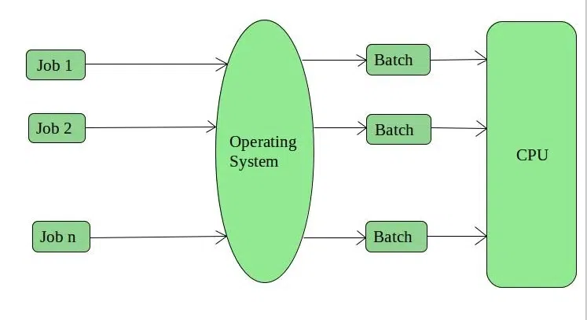
**Advantages of Batch Operating System:**

1. **Multiple users** can use the system at the same time.
2. **Low idle time**: The system uses its resources effectively.
3. **Easy to manage**: Large tasks can be handled easily in batches.

**Disadvantages of Batch Operating System:**

1. **Inefficient CPU use**: When a process is waiting for I/O, the CPU remains idle.
2. **Delay if a job fails**: Other jobs must wait if one job fails.
3. **Slower response**: Since tasks are processed one by one, it increases the waiting time.

**Examples**: Payroll systems, bank statement processing.

---

2. **Multi-Programming Operating System:**

    - **Multiple programs in memory**: Several programs are loaded into memory.
    - **One runs at a time**: The OS runs one program while others wait.
    - **Better resource usage**: Maximizes CPU and memory use.
    - **Improved efficiency**: Helps the system perform better by reducing idle time.

  
---

3. **Multi-Tasking/Time-sharing Operating Systems:**

- **Type of Multiprogramming**: Multiple tasks are running at the same time.
- **Round-robin execution**: Each task gets a fixed amount of time (called "quantum") to execute.
- **Fair CPU sharing**: Every user gets CPU time on a single system.
- **Task switching**: After the time is up, the OS switches to the next task.
- **Multitasking**: Can handle tasks from one or many users. 

**Key to remember:** Tasks run in turns, with each task getting equal time to execute.

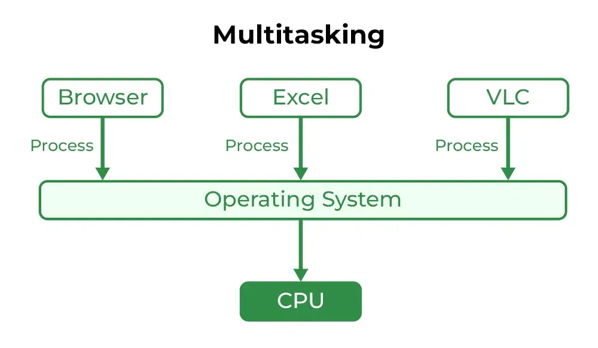

### **Time-Sharing OS (Key Concepts & Easy Recall)**  

✅ **Advantages:**  
- **Equal CPU time** for every task.  
- **Less duplication** of software.  
- **Reduced CPU idle time** (efficient use).  
- **Resource Sharing** (CPU, memory, devices).  
- **Faster work** (multiple users work at once).  
- **Real-time interaction** (better user experience).  

❌ **Disadvantages:**  
- **Reliability issues** (system crashes can affect many users).  
- **Security risks** (shared access requires strict security).  
- **Data communication problems** (managing multiple users is complex).  
- **High overhead** (scheduling, switching tasks takes resources).  
- **Complex system** (needs advanced management).  

📌 **Examples:**  
- **IBM VM/CMS** – Virtual machines for multiple users.  
- **TSO (IBM 360)** – Early IBM mainframe OS for shared use.  
- **Windows Terminal Services** – Remote multi-user access to Windows.  

**Easy Trick to Remember** 🧠: **"Time-sharing = Equal Turns for All Users"** ⏳

---

4. ### **Multi-Processing OS (Easy & Quick Recall)**  

📌 **Key Idea:**  
- Uses **multiple CPUs** to execute tasks.  
- **Boosts system speed** by running tasks in parallel.  

✅ **Advantages:**  
- **Faster processing** (tasks run simultaneously).  
- **High system throughput** (more work done at once).  
- **Fault tolerance** (if one CPU fails, others continue).  

🧠 **Easy Trick to Remember:**  
**"Multi-Processing = Multiple CPUs = Faster & Reliable!"** 🚀

---

5. ### **Multi-User OS (Easy & Quick Recall)**  

📌 **Key Idea:**  
- **Multiple users** can use the system **simultaneously**.  
- Can have **one or multiple processors** handling tasks.  

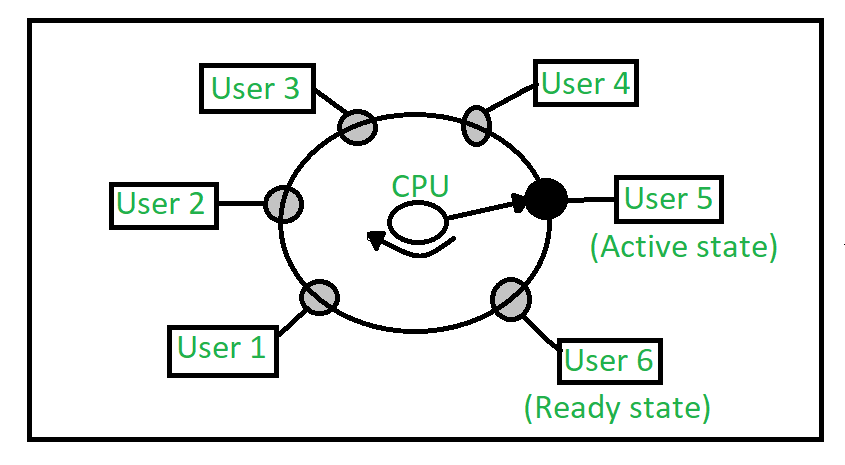

✅ **Advantages:**  
- **Resource sharing** (CPU, memory, storage).  
- **Cost-effective** (one system for many users).  
- **Efficient use of hardware** (reduces idle time).  

🧠 **Easy Trick to Remember:**  
**"Multi-User = Many Users, One System Working Together!"** 👥💻

---

6. ### **📌 Distributed Operating System (Easy & Quick Recall)**  

🔹 **Key Idea:**  
- Multiple independent computers **work together** using a **shared network**.  
- Each computer has its **own CPU & memory** (loosely coupled system).  
- Enables **remote access** to files/software from any system in the network.  
- **Examples**: LOCUS.

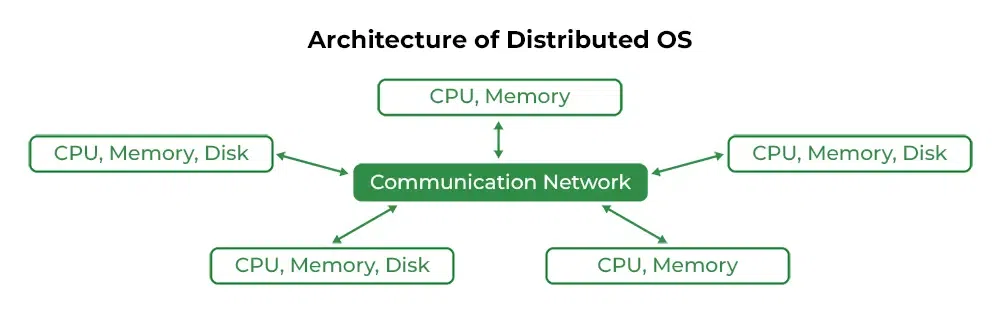

✅ **Advantages:**  
✔ **No Single Point of Failure** – If one system fails, others keep working.  
✔ **Faster Data Exchange** – Email & file sharing happen quickly.  
✔ **High Performance** – Shared resources = faster computing.  
✔ **Scalable** – Can add more systems easily.  
✔ **Less Load on Host** – Tasks are distributed across systems.  

❌ **Disadvantages:**  
✖ **Network Failure = Total Halt** – If the network crashes, everything stops.  
✖ **Complex & Costly** – Expensive setup & difficult to maintain.  
✖ **Security Issues** – Data can be intercepted over public networks.  

⚡ **Issues to Remember:**  
- **Data Delay** – Messages take time to transfer.  
- **Complex Management** – Scheduling & resource allocation across nodes.  
- **Security Risks** – Hackers can tamper with messages.  

💡 **Easy Trick to Remember:**  
🖥️ **"Distributed = Many Computers, One System Working Together!"** 🌍🚀

---

7. ### **📌 Network Operating System (Easy & Quick Recall)**  

🔹 **Key Idea:**  
- Runs on a **server** to **manage data, users, security, and applications**.  
- Allows **file & printer sharing** over a **private network**.  
- Users **know** about other users & connections (**tightly coupled system**). 

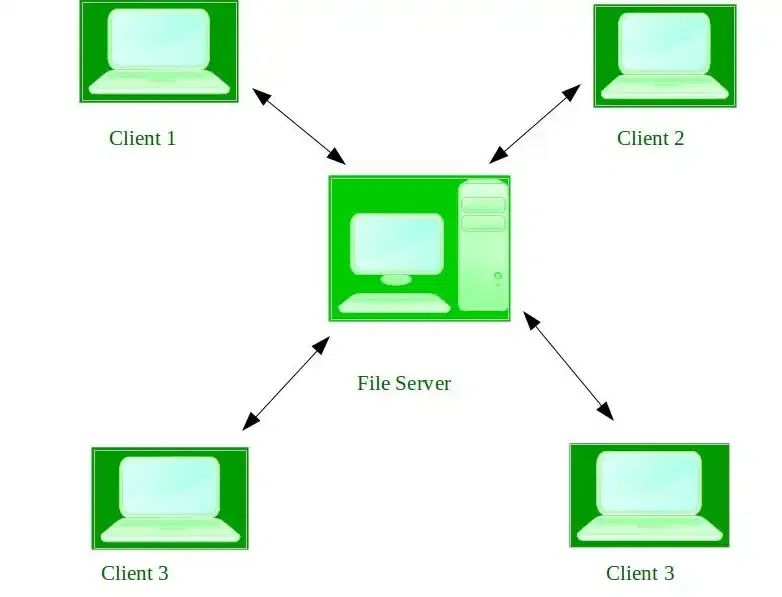

✅ **Advantages:**  
✔ **Stable & Secure** – Centralized control improves security.  
✔ **Easy Upgrades** – New tech & hardware can be added easily.  
✔ **Remote Access** – Users can connect from different locations.  

❌ **Disadvantages:**  
✖ **Expensive Servers** – High initial cost.  
✖ **Centralized Dependency** – If the main server fails, all users are affected.  
✖ **Regular Maintenance** – Needs frequent updates & monitoring.  

💡 **Examples:**  
🖥 **Windows Server (2003, 2008), UNIX, Linux, Mac OS X, Novell NetWare, BSD**  

⚡ **Easy Trick to Remember:**  
🌐 **"Network OS = Central Brain 🧠 Controlling Many Computers!"** 🚀

---

8. ### **📌 Real-Time Operating System (RTOS) – Quick & Easy Recall**  

🔹 **Key Idea:**  
- Designed for **time-critical** tasks where **fast response** is crucial.  
- Used in **missile systems, air traffic control, robots, medical devices**.  
- **Response Time** must be **very small** to ensure safety & efficiency.  

### **Types of RTOS:**  
⚡ **Hard Real-Time OS:**  
✔ **Strict timing rules** – No delays allowed.  
✔ Used in **life-saving systems** (e.g., airbags, parachutes).  
✔ **No virtual memory** (ensures immediate response).  

⚡ **Soft Real-Time OS:**  
✔ Timing is important but **small delays are acceptable**.  
✔ Used in **less strict applications** (e.g., video streaming).

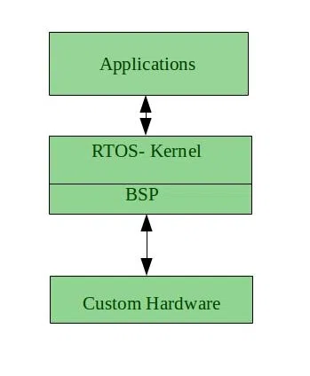

### ✅ **Advantages of RTOS:**  
✔ **Maximum Resource Utilization** – Efficient use of devices.  
✔ **Fast Task Switching** – Quick transition between processes.  
✔ **Application Focused** – Prioritizes active tasks.  
✔ **Error-Free** – Highly reliable for critical tasks.  
✔ **Best Memory Management** – Optimized for efficiency.  

### ❌ **Disadvantages of RTOS:**  
✖ **Limited Tasks** – Only a few tasks can run at once.  
✖ **High System Requirements** – Needs powerful & expensive hardware.  
✖ **Complex Algorithms** – Difficult to design & implement.  
✖ **Special Drivers Needed** – Requires specific **device drivers & interrupt signals**.  
✖ **Thread Priority Issues** – Less flexible in prioritizing tasks.  

### 💡 **Examples:**  
🛫 **Air Traffic Control**  
🦾 **Robotics & Medical Imaging**  
🔬 **Scientific Experiments**  
🔫 **Weapon Systems**  
🏭 **Industrial Automation**  

⚡ **Easy Trick to Remember:**  
🎯 **"RTOS = Fast, Precise & Critical 🚀 (No Delays Allowed!)"**

---

9. ### **📌 Mobile Operating Systems – Quick & Easy Recall**  

🔹 **Key Idea:**  
- Designed **specifically for mobile devices** (smartphones, tablets).  
- Examples: **Android, iOS** (most common).  

### ✅ **Why Mobile OS is Important?**  
✔ **Optimized for Touch & Portability** – Built for small screens & low power usage.  
✔ **App-Based Ecosystem** – Runs millions of apps (Play Store, App Store).  
✔ **Connectivity Features** – Supports Wi-Fi, Bluetooth, GPS, etc.  
✔ **Security & Updates** – Regular updates for safety & performance.  

---

### **📌 Conclusion (Simple & Clear)**  

🔹 **Why OS Matters?**  
- Different operating systems exist for **different needs**.  
- Some manage **large jobs** (Batch OS), some allow **multiple users** (Multi-User OS).  
- Others handle **networked systems** (Network OS) or **time-sensitive tasks** (RTOS).  
- **Mobile OS** powers our **phones & tablets**.  

💡 **Choosing the right OS = Better efficiency & performance!** 🚀

---

Here’s a simplified and easy-to-remember version of the explanation:  

---

### **What is a Kernel?**  
The **kernel** is the **core** of an operating system. It acts as a **bridge** between **software applications** and the **hardware** of a computer.  

### **Key Responsibilities of a Kernel:**  
- Manages **CPU, memory, and devices**  
- Runs programs and manages **system stability**  
- Prevents unauthorized access to resources  

---

## **Types of Kernels**  

### 1️⃣ **Monolithic Kernel** (All-in-One)  
🔹 **Everything runs in kernel space** (fast but complex).  
🔹 Example: **Linux, Unix**  

✅ **Fast & efficient**  
✅ **Simple design**  
❌ **Bugs affect the entire system**  
❌ **Hard to maintain**  

---

### 2️⃣ **Microkernel** (Minimalist)  
🔹 **Only essential services run in kernel space** (rest in user space).  
🔹 Example: **Minix, Mach**  

✅ **Stable & secure**  
✅ **Easier to modify**  
❌ **Slower due to more context switching**  
❌ **More complex design**  

---

### 3️⃣ **Hybrid Kernel** (Best of Both Worlds)  
🔹 **Combines Monolithic & Microkernel features**  
🔹 Example: **Windows NT, macOS**  

✅ **Balanced speed & flexibility**  
✅ **More stable than Monolithic**  
❌ **More complex than both**  

---

### 4️⃣ **Exokernel** (Raw Performance)  
🔹 **Minimal abstraction, direct hardware access**  
🔹 Example: **ExOS, Nemesis**  

✅ **High speed & efficiency**  
✅ **Fine control over resources**  
❌ **Difficult to develop & debug**  

---

### 5️⃣ **Nano Kernel** (Ultra Lightweight)  
🔹 **Minimal hardware abstraction, no system services**  
🔹 Example: **EROS**  

✅ **Highly modular & portable**  
✅ **More secure (small attack surface)**  
❌ **Limited functionality**  

---

### **How Does a Kernel Work?**  
1️⃣ **Loads into memory** when the OS starts  
2️⃣ **Manages processes** (scheduling, execution)  
3️⃣ **Allocates memory & system resources**  
4️⃣ **Handles device communication**  
5️⃣ **Ensures security & access control**  

---

### **Why is the Kernel Important?**  
✅ Enables software & hardware communication  
✅ Ensures smooth multitasking  
✅ Provides system security & stability  

💡 **In simple terms:** The kernel is like a **traffic controller** that ensures programs, memory, and devices work together efficiently! 🚦  

### **📌 Kernel in Operating System – Easy & Memorable Explanation**  

🔹 **What is the Kernel?**  
- The **Kernel** is the **brain** of the Operating System.  
- It is **the first program loaded** when a computer starts (after the bootloader).  
- It acts as a **bridge** between software (apps) and hardware (CPU, memory, devices).  

---

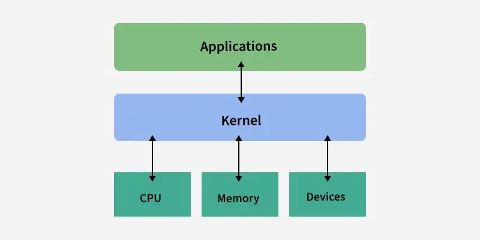

### **💡 What Does the Kernel Do?**  
✅ **Manages System Resources** – Controls CPU, memory, and connected devices.  
✅ **Runs Programs** – Handles process execution.  
✅ **Accesses Files & Devices** – Connects apps to hardware like printers, keyboards, etc.  
✅ **Ensures Security & Stability** – Prevents unauthorized access and system crashes.  
✅ **Facilitates Communication** – Helps software interact with hardware smoothly.  

---

### **🔑 Quick Recap to Remember**  
📌 **Kernel = Core of OS** (Manages everything inside the system)  
📌 **Acts as a Bridge** (Connects software & hardware)  
📌 **First to Load, Last to Exit** (Essential for OS operation)  

💡 **Think of the Kernel as the 'Manager' of a Computer, making sure everything runs smoothly!** 🚀

### **📌 System Call – Easy & Memorable Explanation**  

### **🔹 What is a System Call?**  
A **System Call** is a way for a program to **request services from the Operating System (OS)**.  
- It acts as a **bridge** between a program and the OS kernel.  
- When a program needs OS-level tasks like **creating a file, running a process, or accessing hardware**, it **calls the kernel** using a system call.  
- System calls allow programs to **communicate with hardware securely** without direct access.  

---

### **💡 How Does a System Call Work?**  
1️⃣ A **program requests a service** (e.g., open a file).  
2️⃣ The request **switches to kernel mode** (higher privilege).  
3️⃣ The OS **executes the requested task** (e.g., reads the file).  
4️⃣ The result is **sent back to the program**.  

---

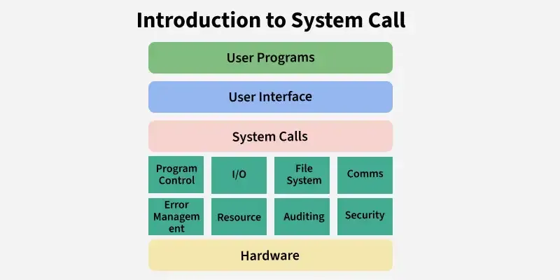

---
### **🔑 Why Are System Calls Important?**  
✅ **Allows software to interact with hardware** (printers, files, etc.).  
✅ **Ensures security** (programs can't directly access system resources).  
✅ **Standardized way to access system features** (file handling, process control).  

---

### **📂 Types of System Calls**  
🖥 **1. Process Control** – Creating, managing, and terminating processes.  
📁 **2. File Management** – Creating, reading, writing, and closing files.  
🖨 **3. Device Management** – Accessing hardware like printers and keyboards.  
📊 **4. Information Maintenance** – Managing system data (time, process ID).  
🔄 **5. Communication** – Interprocess communication (sending messages).  

---

### **🛠 Common System Calls (Windows vs. Unix)**  
| Task              | Windows System Call  | Unix System Call |
|------------------|---------------------|-----------------|
| **Create Process** | `CreateProcess()`  | `fork()`        |
| **End Process**   | `ExitProcess()`    | `exit()`        |
| **Open File**     | `CreateFile()`     | `open()`        |
| **Read File**     | `ReadFile()`       | `read()`        |
| **Write File**    | `WriteFile()`      | `write()`       |
| **Close File**    | `CloseHandle()`    | `close()`       |

---

### **⚡ Key System Calls to Remember**  
📌 **`wait()`** – Makes a process wait until its child process finishes.  
📌 **`exec()`** – Replaces the current process with a new program.  
📌 **`fork()`** – Creates a new child process from a parent process.  
📌 **`exit()`** – Terminates a process and releases resources.  
📌 **`kill()`** – Sends a signal to terminate a process.  

---

### **🔒 Privileged Instructions (Kernel Mode Only)**  
Some instructions **can only be executed by the OS Kernel**, ensuring system security.  
These include:  
✅ Direct **hardware access**  
✅ **Memory management**  
✅ **I/O operations**  

---

### **💡 Quick Recap for Easy Memorization**  
📌 **System Call = Request to OS for a service**  
📌 **Acts as a bridge between programs & hardware**  
📌 **Ensures security by limiting direct hardware access**  
📌 **Used for process, file, device, and communication management**  

💡 **Think of a System Call as a 'Service Request' sent to the OS whenever a program needs help!** 🚀

---
---
---
# **Process in OS - Easy & Rememberable**  

- **Process = Program in Execution**  
  - A program (C/C++/Python, etc.) is just a file until it runs.  
  - When executed, it becomes an **active process**.  

- **Example:**  
  - Writing a C program → Compiling it → Creates a binary file (program).  
  - Running the binary → Turns into a **process**.  

- **Key Points:**  
  - **Program = Passive (just code).**  
  - **Process = Active (running instance).**  
  - One program can create **multiple processes** (e.g., opening a browser multiple times creates multiple processes).  

### **Memory Layout of a Process - Easy & Rememberable** 

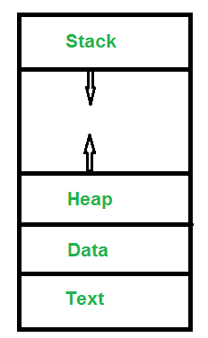

A process in memory has **4 main sections**:  

1. **Text (Code) Section** 📜  
   - Stores executable instructions (read-only).  
   - Example: The actual C/C++/Python code being executed.  

2. **Stack** 📌  
   - Holds temporary data like **function parameters, return addresses, and local variables**.  
   - Grows and shrinks as functions are called and return.  

3. **Data Section** 📊  
   - Stores **global variables**.  
   - Example: `int x = 10;` (declared outside functions).  

4. **Heap** 🏗️  
   - Stores **dynamically allocated memory** (e.g., `malloc()` in C, `new` in C++).  
   - Grows as needed during program execution.  

🔥 **Quick Trick to Remember:** **T S D H** → **"The Smart Data Heap"**  
(T = Text, S = Stack, D = Data, H = Heap) ✅

### **Process Lifecycle - Easy & Rememberable**  

A process goes through different **phases** (states) during its lifecycle.

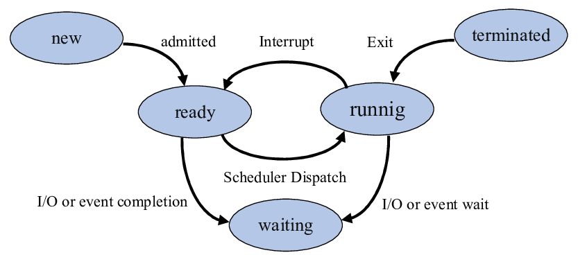

 Here’s the **5-state process model** in simple terms:

1. **New** 🆕  
   - The process is just **created**. It hasn't started running yet, but its **Process Control Block (PCB)** has been created to store info about the process.

2. **Ready** ⏳  
   - The process is **ready to run**, waiting for the **CPU** to be free. It’s like waiting in line to get a turn.

3. **Running** 🏃‍♂️  
   - The process is **actively running** on the CPU. Only **one process** can be in this state at a time.

4. **Blocked/Waiting** 💤  
   - The process cannot run right now. It is **waiting for something** to happen, like finishing an I/O operation (e.g., reading from disk).

5. **Exit/Terminate** 🛑  
   - The process has **finished** or has been **stopped**. It’s **removed from memory** and released by the operating system.

🔥 **Quick Trick to Remember:** **N R R B E** → **"New Ready Running, Blocked Exit"**  
(Just remember the first letters of each state!) ✅

### **Process Control Block (PCB) - Easy & Rememberable**  

A **Process Control Block (PCB)** is like the **identity card** of a process. It helps the **Operating System (OS)** track and manage processes.

Here’s what it stores:

1. **Process Status** 🟢🛑:  
   - The **current state** of the process (Ready, Running, Blocked, etc.).

2. **Program Counter (PC)** ⏯️:  
   - The address of the next instruction the process will execute.

3. **Memory Usage** 🧠:  
   - Details about the memory the process is using.

4. **Open Files** 📂:  
   - Information about files that the process has opened.

5. **CPU Scheduling Info** 🖥️:  
   - Information about how the process will be scheduled to run on the CPU.

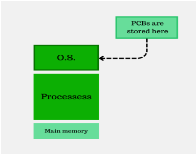

### **How It Works:**
- **Creation**: When a process is created, its **PCB** is created too. It’s like a guide for the OS on how to manage the process.
- **Process Table** 📋:  
   - The **Process Table** is an **array** of all PCBs in the system. It tracks every process currently running.

### **Quick Trick to Remember**:  
**S-P-M-O-C** → **"Status, PC, Memory, Open Files, CPU"**

Just remember the order of what the PCB tracks! ✅

### **Structure of Process Control Block (PCB) - Easy & Rememberable**

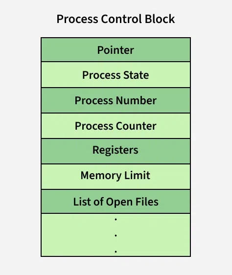

A **Process Control Block (PCB)** is like a **record book** 📖 that stores everything about a process. The OS uses it to manage and control processes efficiently.  

### **Main Components of a PCB** 🏗️  

1. **Process State** 🔄  
   - Shows if the process is **Running, Ready, Waiting, or Terminated**.  

2. **Process ID (PID)** 🆔  
   - A **unique number** given to every process by the OS.  

3. **Program Counter (PC)** ⏯️  
   - Stores the address of the **next instruction** to be executed (useful during context switching).  

4. **CPU Registers** 🎯  
   - Stores important data like **accumulators, index registers, stack pointers**, etc.  

5. **CPU Scheduling Info** 🖥️  
   - Stores priority levels and scheduling **algorithms** to decide which process runs next.  

6. **Memory Management Info** 🧠  
   - Keeps track of **base & limit registers, page tables, or segment tables** for memory access.  

7. **Accounting Info** 📊  
   - Tracks **CPU time used, time limits, job/process numbers, and resource usage**.  

8. **I/O Status Info** 🎧  
   - Stores **allocated I/O devices** (printers, hard disks) and open files list.  

9. **List of Open Files** 📂  
   - Contains all files that the process has opened.  

### **Quick Trick to Remember** 🧠  
**S-P-P-C-C-M-A-I-F** → **"Some People Play Chess, Computers Make All Intelligent Files"**  

This helps recall the **9 key elements** of a PCB easily! ✅